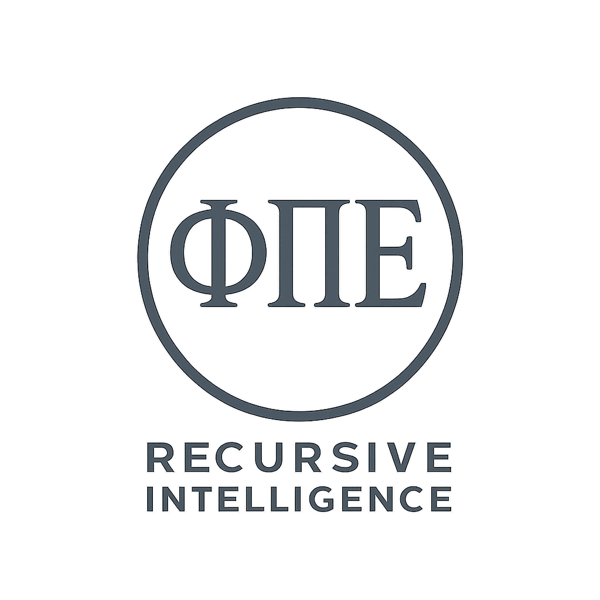

<p align="center">
  
</p>

<h1 align="center">RI1 Hybrid Generative Engine</h1>

<p align="center">
  
  
  
  
</p>

Rust-first, privacy-first neuro-symbolic, multimodal-capable, agentic AI for Windsurf IDE workflows on macOS. Constraint evaluation is text-based (\texttt{Constraint::check(\&str)}); multimodal constraint checking is planned for a future phase.

## Roadmap Phases
- Phase 0: Foundation & Setup
- Phase 1: Core Architecture
- Phase 2: Symbolic Reasoning Engine
- Phase 3: Modality Implementations
- Phase 4: Agent Orchestration
- Phase 5: Interface & Tooling
- Phase 6: Testing, Optimization & Launch

## Quick Start
- Install Rust and cargo
- Open in Windsurf with rust-analyzer
- `cargo build -p ri1-core`

---

<p align="center">
  Built by <strong>Recursive Intelligence One (RI1)</strong>
</p>

## InfluenceSnapshot (Phase 3 m3)

The meta-engine computes and exposes canonical influence signals capturing agent/operator influence and negotiation dynamics.

- Returned via API: `MetaEngineImpl::evaluate_meta_with_snapshot(modality, content, ctx)`
- Surfaced in CLI JSON envelopes when `--log-file` is used.

Envelope example:

```json
{
  "correlation_id": "...",
  "modality": "text",
  "content": "Ψ : Φ / Ψ | Γ = Ω",
  "constraints": [ ... ],
  "events": [ ... ],
  "timestamp_unix_s": 1731170000,
  "influence": {
    "resonance_index": 0.80,
    "operator_influence": [
      { "operator": "InteractionNotice", "weight": 0.57 },
      { "operator": "DirectionalGrowth", "weight": 0.07 },
      { "operator": "Oscillation", "weight": 0.07 }
    ],
    "cooperation_count": 1,
    "conflict_count": 2,
    "negotiation": [
      { "from": "Fusion", "to": "StructuralIllumination", "relation": "reinforce", "weight": 0.6 }
    ],
    "notes": null
  }
}
```

Fields:

- `resonance_index`: 0.0–1.0 harmonic balance score.
- `operator_influence`: normalized weights per `OperatorClass`.
- `cooperation_count` / `conflict_count`: coarse cooperation/conflict tallies.
- `negotiation`: edges between operators with `relation` and `weight`.
